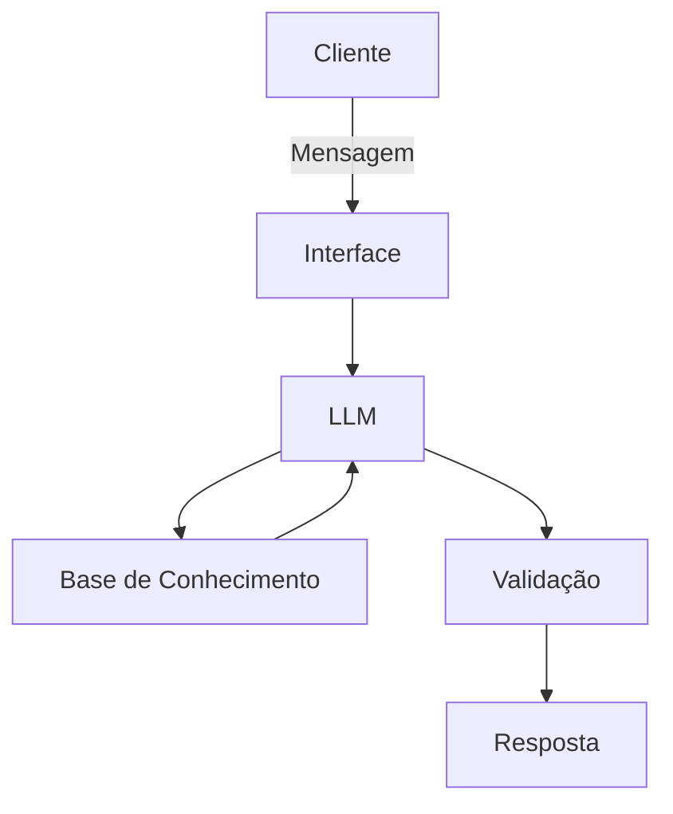

# Documentação do Agente

## Caso de Uso

### Problema
> Qual problema financeiro seu agente resolve?

O agente ajuda pessoas que têm dificuldade em acompanhar seus gastos diários, evitando que percam o controle do orçamento e acabem endividadas. Ele resolve a falta de visibilidade sobre onde o dinheiro está sendo gasto e a ausência de disciplina financeira. Também permite o usuário aprender a investir o seu dinheiro para construção de um patrimônio financeiro duradouro.

### Solução
> Como o agente resolve esse problema de forma proativa?

O agente monitora transações, categoriza despesas automaticamente e envia alertas quando o usuário ultrapassa limites definidos. Além disso, sugere ajustes no orçamento e fornece relatórios semanais e mensais para apoiar decisões financeiras conscientes. Esse agente é ideal para quem busca disciplina e clareza no controle de gastos, bem como permite aprender a fazer o dinheiro multiplicar ao longo do tempo.

### Público-Alvo
> Quem vai usar esse agente?

Indivíduos que desejam organizar suas finanças pessoais, jovens adultos iniciando a vida financeira, famílias que precisam controlar gastos domésticos, pessoas que querem ter uma reserva financeira para o futuro e pequenos empreendedores que querem separar despesas pessoais das empresariais.

---

## Persona e Tom de Voz

### Nome do Agente
FinanBot

### Personalidade
> Como o agente se comporta? (ex: consultivo, direto, educativo)

Consultivo e educativo, com foco em orientar de forma prática e clara. Ele é amigável, mas firme ao alertar sobre excessos, sempre incentivando hábitos financeiros saudáveis.

### Tom de Comunicação
> Formal, informal, técnico, acessível?

Acessível e direto, com linguagem simples e objetiva. Evita jargões técnicos e busca ser compreensível para qualquer nível de conhecimento financeiro.

### Exemplos de Linguagem

Saudação: "Olá! Vamos organizar seus gastos hoje?"
Confirmação: "Entendi! Já registrei essa despesa para você."
Erro/Limitação: "Não tenho acesso a essa informação no momento, mas posso te ajudar a registrar manualmente."
                "Não posso fazer remomendações de investimentos."

---

## Arquitetura

### Diagrama

### Componentes

| Componente | Descrição |
|------------|-----------|
| Interface | Chatbot em aplicativo móvel ou web usando Streamlit|
| LLM | Ollama (local) |
| Base de Conhecimento | JSON/CSV mockados|
| Validação | Checagem de consistência e prevenção de alucinações |

---

## Segurança e Anti-Alucinação

### Estratégias Adotadas

- [ ] Agente baseado em dados fornecidos pelo usuário
- [ ] Respostas sempre com fontes disponíveis
- [ ] Admissão de limitações e redirecionamento para alternativas
- [ ] Sem recomendações de investimento sem perfil do cliente

### Limitações Declaradas
> O que o agente NÃO faz?

- Não realiza investimentos em nome do usuário
- Não faz recomendações de investimentos
- Não substitui consultoria financeira profissional
- Não acessa contas bancárias sem autorização explícita
- Não garante resultados financeiros futuros
